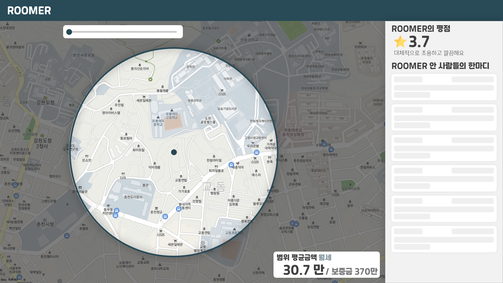
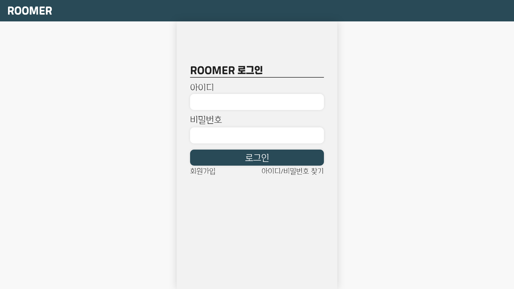
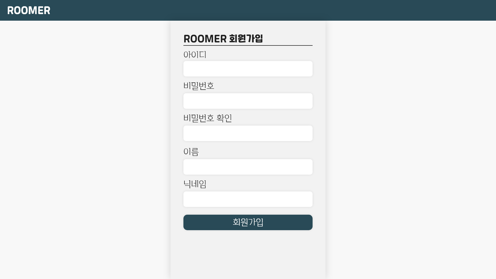
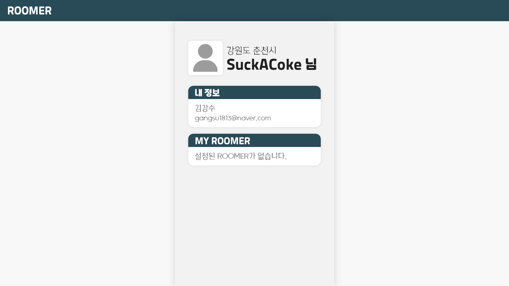

# **2022-web-framework-project**
2022학년도 2학기 웹프레임워크의 기말 프로젝트 Repo 입니다.  
 

## **주제**
국토교통부 주택가격 API를 활용한 주택가격 조회 사이트  
 

## **사용 데이터 및 API**
- ### 국토교통부 단독/다가구 전월세 자료 (공공데이터포털)
    - https://www.data.go.kr/tcs/dss/selectApiDataDetailView.do?publicDataPk=15058352  

- ### 국토교통부 연립다세대 전월세 자료 (공공데이터포털)
    - https://www.data.go.kr/tcs/dss/selectApiDataDetailView.do?publicDataPk=15058016  

- ### 강원도_춘천시 요식업소 현황 (공공데이터포털)
    - https://www.data.go.kr/data/15003349/fileData.do
    - Local에서 편의점 데이터 추출 및 좌표 변환  

- ### 카카오 지도 API (카카오)
    - https://apis.map.kakao.com/web/  
 

## **사용 서체**
- ### 레시피코리아 레코체 : 로고
    - https://noonnu.cc/font_page/394  

- ### 카페24 심플해 : 상세 부분
    - https://noonnu.cc/font_page/344  
 

## **구현할 내용**
- ### 메인 페이지
    - 특정동 / 특정 범위의 전월세 평균 데이터 제공
    - 현대 직방, 다방에 등록되어 있는 매물 데이터 제공
    - 편의점 위치 데이터
    - 쓰레기처리장에 대한 데이터 제공  

- ### 로그인 페이지
    - 아이디 / 비밀번호 입력 화면
    - 로그인 버튼
    - 회원가입, 아이디 비밀번호 찾기

- ### 회원가입 페이지
    - 개인정보 입력 기능
    - 회원가입 버튼

- ### 내 정보 페이지
    - 지역, 닉네임 표시
    - 개인정보 표시
    - ‘MY ROOMER’ - 현재 본인이 거주 하고 있는 지역(범위)

